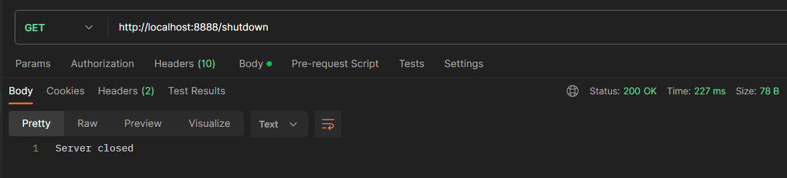

# Instancier un Vert.X

On va créer une instance de `Vertx`. C'est le point de départ de l'application. C'est via cette instance que l'on va générer les objets Verticle qui vont traiter les requêtes HTTP.

```java
public class Main {
    
    private static Vertx vertx;
    
    public static void main (String[] args) {
        vertx = Vertx.vertx();
        // ...
```

# La classe Verticle

On va ensuite créer la classe des Verticle.

```java
public class Server extends AbstractVerticle {
    @Override
    public void start (Promise<Void> startPromise) throws Exception {
        // ...
    }
    
    @Override
    public void stop () throws Exception {
        System.out.println("Stop Verticle");
    }
}
```

La méthode start est appelée quand on crée une nouvelle instance de `Server`. Dans cette méthode, on va paramétrer un routeur avec les différentes routes acceptées et le port d'écoute.

La méthode stop(), quant à elle

## Router

On définit le router dans le `start()` de `Server` et on lui affecte une route :

```java
Router router=Router.router(vertx);
    router.get("/*").handler(req->{
    req.response()
    .putHeader("content-type","text/plain")
    .end("Hello from Vert.X !");
    }); 
```

> **Note** : Attention à l'ordre des routes.
>
> Si une route est définie après la route `/*` (qui accepte n'importe quels paramètres), elle ne sera pas accessible.

:warning: **ATTENTION** : Pensez à paraméter la réponse, sous peine de recevoir une `NullPointerException`.

## Port d'écoute

On définit le port d'écoute dans le `start()` de `Server` :

```java
vertx.createHttpServer().requestHandler(router).listen(8888,http->{
    if(http.succeeded()){
    startPromise.complete();
    System.out.println("HTTP server started on port 8888");
    }else{
    startPromise.fail(http.cause());
    System.out.println("HTTP server COULDN'T start");
    }
    });
```

# Instancier un Verticle

Dans le main, on va instancier un Verticle (un `Server`) en passant par la méthode `deployVerticle()` de la classe `Vertx`

```java
// ...
private static Vertx vertx;
    // ...
    vertx=Vertx.vertx();
    vertx.deployVerticle(new Server());
// ...
```

> **Note** : Une fois déployé, on peut accéder à l'instance du `vertx` via l'instance du Verticle (`Server`)

# Clore le Vertx et tous ses Verticle

Pour mettre fin au programme, `Vertx` possède une méthode `close()` pour l'appeler, on peut passer par un endpoint paramétré sur le router de `Server` par exemple.

```java
router.get("/shutdown").handler(req->{
    Main.vertx.close();
    req.response().putHeader("content-type","text/plain").end("Server closed");
    });
```



```bash
# Retour en console
# Message à la création du serveur HTTP (au paramétrage du port d'écoute)
HTTP server started on port 8888   
# Passage dans la méthode stop() du Server
Stop Verticle

# Fin du programme
Process finished with exit code 0
```

> **Note** : Si l'on crée plusieurs instances de `Server`, on verra plusieurs lignes `HTTP server started on port 8888` puis, après l'appel à /shutdown, plusieurs lignes `Stop Verticle`. 
